# ${\textsf{\color{lightgreen}TRAVELMATE APP}}$


[Link To GitHub Repository](https://github.com/SteaneMurphy/T3A2_FullStackApp)

Clone (HTTPS): <https://github.com/SteaneMurphy/T3A2_FullStackApp.git>

Link To Deployed Site: <https://mytravel-mate.netlify.app>

### **Please note: the version of MongoDB Atlas takes upto 60 seconds to spin up. When making a login or registration request, it may fail as the server is not avaiable. Once making a request, waiting 60 seconds, reloading the page and trying again should work. This applies to both development and production environments**

### **Currently only FRANCE and USA as destinations are available**

Run Locally: [How to install and run this project locally](#installation)

## ${\textsf{\color{lightgreen}PROJECT DESCRIPTION}}$

### ${\textsf{\color{lightblue}PURPOSE}}$

TravelMate Itinerary Builder is designed to assist TravelMate, a boutique travel agency, in overcoming challenges related to efficiently managing personalised travel itineraries for their clients. According to a study by American Express Travel (2024), 85% of travellers plan to book a personalised travel experience in 2024, reflecting a growing desire for unique and tailor-made itineraries. However, 67% of small to medium-sized travel agencies struggle with operational inefficiencies due to the manual handling of these itineraries, often resulting in errors and reduced client satisfaction (Skift Research, 2023).

TravelMate faced the difficulty of tracking and managing client needs alongside their increasing workload. The Global Business Travel Association (2023) reported that 75% of travel agencies have seen a 50% increase in client expectations for personalised service, significantly increasing the workload on travel agents. This manual process often led to delays and inconsistencies in service delivery.

The TravelMate Itinerary Builder addresses these issues by providing a streamlined, automated solution that simplifies the process of creating and managing travel itineraries. Automation in travel management, as identified by McKinsey & Company (2024), can reduce operational workload by up to 30%, allowing travel agencies to focus more on enhancing client experiences.

### ${\textsf{\color{lightblue}FEATURES}}$

- **Home Page**: Includes login inputs for user authentication.
- **Registration Page**: A dedicated page with multiple inputs for new users to register.
- **Dashboard**: Displays existing itineraries for the user.
- **Create New Itinerary Page**: Allows users to create new travel itineraries.
- **View Single Itinerary Page**: Enables users to view details of a single itinerary.

### ${\textsf{\color{lightblue}TARGET AUDIENCE}}$

- **Travel Agents**: Professionals who need a tool to create and manage travel itineraries for clients quickly and efficiently.
- **Frequent Travellers**: Individuals who frequently plan trips and want an organised way to manage their itineraries.
- **Travel Enthusiasts**: Anyone interested in exploring new destinations and needing a tool to plan their travels effectively.

### ${\textsf{\color{lightblue}TECH STACK}}$

- **Front-End**: React.js, Bulma, GSAP, Leaflet, React-Leaflet, React-Router-Dom, React-Transition-Group, Zustand
- **Back-End**: Node.js, Express.js
- **Database**: MongoDB, Mongoose
- **Authentication**: JSON Web Tokens (JWT)
- **Environment Management**: dotenv
- **File Uploads**: Multer
- **Testing**: Jest, Supertest
- **Version Control**: Git
- **Build Tool**: Vite
- **Linting**: ESLint

### Backend Dependencies

- **Express.js** - For building the backend API and handling routing.
- **Mongoose** - For interacting with MongoDB, defining schemas, and managing database operations.
- **dotenv** - For loading environment variables from a `.env` file.
- **bcrypt** - For hashing passwords during user authentication.
- **jsonwebtoken** - For generating and verifying JSON Web Tokens (JWT) for user authentication.
- **cors** - For handling Cross-Origin Resource Sharing (CORS) in your Express app.
- **Jest** - For writing and running tests.
- **Supertest** - For testing HTTP requests in your backend API.

### Frontend Dependencies

- **React.js** - For building the frontend user interface.
- **React Router** - For managing routing within the React app.

### Testing Dependencies

- **Jest** - Used for unit and integration testing on both the frontend and backend.
- **Supertest** - Used for making HTTP assertions and testing your API.

## ${\textsf{\color{lightgreen}DIAGRAMS}}$

### ${\textsf{\color{lightblue}DATAFLOW DIAGRAM (LucidChart, 2024)}}$

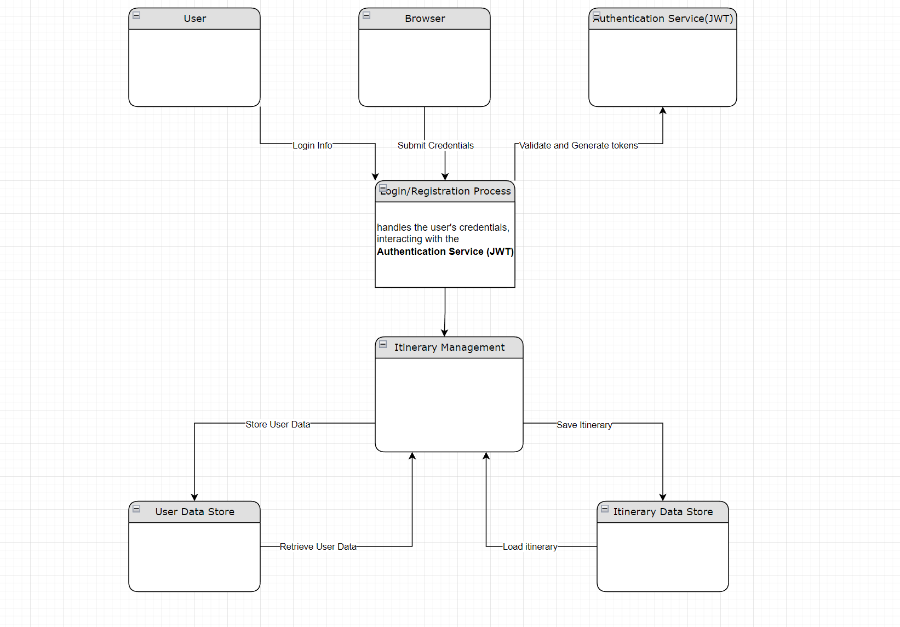

- **User Interaction:** The user interacts with the system through a Browser.
- **Login/Registration Process:**
  - Handles the user's credentials.
  - Interacts with the Authentication Service (JWT) to validate and generate tokens.
- **Itinerary Management Process:**
  - Handles requests related to itineraries.
  - Interacts with the User Data Store and Itinerary Data Store for saving and retrieving data.
- **Data Flows:**
  - Shows how information like login credentials, authentication tokens, and itinerary details move between these components.

### ${\textsf{\color{lightblue}APPLICATION ARCHITECTURE DIAGRAM (LucidChart, 2024)}}$

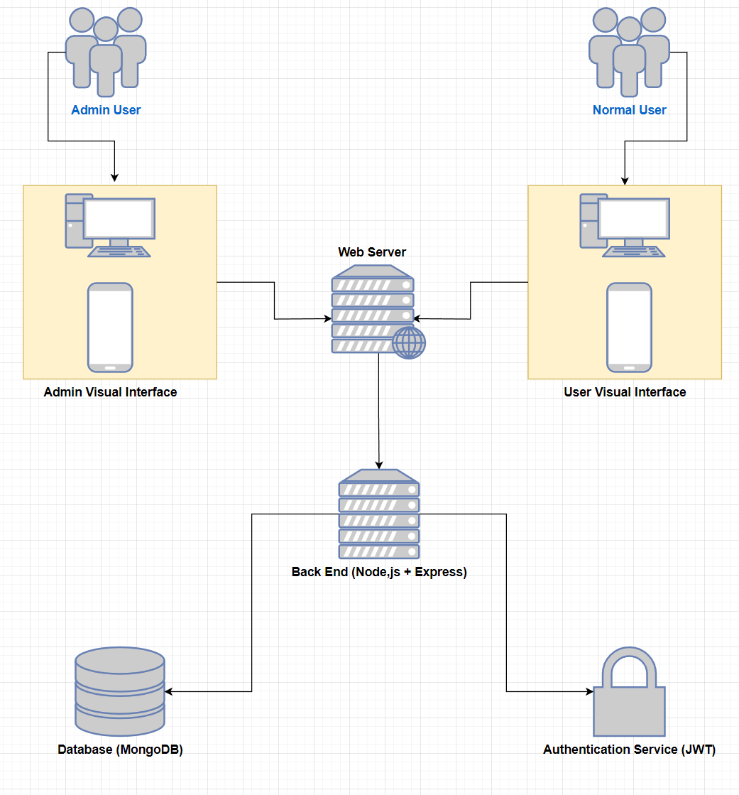

- **Admin User and Normal User:** Represent the different user roles interacting with the system.

- **Admin Visual Interface and User Visual Interface:** The respective interfaces that admins and normal users interact with.

- **Web Server:** Centralises the handling of requests from both admin and normal users, routing them through the back-end.

- **Back-End (Node.js + Express):** Manages business logic and processes requests.

- **Database (MongoDB):** Stores all application data.

- **Authentication Service (JWT):** Manages user authentication and session handling.

## ${\textsf{\color{lightgreen}USER STORIES}}$

##### ${\textsf{\color{pink}Account Creation and Management}}$

A frequent traveler who likes to keep their plans organised wants to create an account so they can securely store and access their travel itineraries across different devices. Initially, the focus was on simply creating an account, but the revised version emphasizes the need for secure access to itineraries on multiple devices.

**"I am a user without an account and I would like to make one"**

**"I am a user with an existing account and I would like to login"**

##### ${\textsf{\color{pink}Itinerary Creation}}$

A busy professional with limited time for travel planning wants to quickly create a new itinerary by entering key destinations and dates, allowing them to efficiently organize their trip without missing important details. Initially, the idea was centered around simple itinerary creation, but the revision now emphasizes efficiency and the importance of capturing key travel details without hassle.

**"I am a user and I would like to name my itineraries so I can tell them apart"**

**"I am a user and I would like to select destinations from a list of countries"**

**"I am a user and I would like to see details of the destinations before I select one"**

**"I am a user and I would like to add/remove destinations or activities from my itinerary"**

##### ${\textsf{\color{pink}Itinerary Editing}}$

A spontaneous traveler who often changes plans wants to easily edit their existing itinerary to update their travel plans on the go as new opportunities arise. Initially, the story was about basic editing, but the revision now focuses on the need for flexibility and the ability to adapt plans as new opportunities emerge.

**"I am a user and I would like to edit my saved itineraries"**

##### ${\textsf{\color{pink}Data Security}}$

A privacy-conscious traveler wants their personal information and itineraries to be securely stored and encrypted so they can trust the app with sensitive travel details and feel safe using it. Initially, the focus was on basic security, but the refined story now highlights the importance of encryption and trust, particularly for users concerned about privacy.

**"I am a user and I would like my personal information safe and secure"**

**"I am a user and I do not want other people able to login to my account"**

**"I am a user and I do not want other people to create an account with my email"**

##### ${\textsf{\color{pink}User Interface and Experience }}$

A user who values simplicity and aesthetics wants the app to have a clean and intuitive user interface so they can navigate it easily and enjoy using it to plan their trips. Initially, the focus was on functionality, but the revision now emphasizes the aesthetic and user-friendly aspects of the interface, aligning with the persona’s values.

**"I am a user and I want to see examples of the places I can travel to"**

**"I am a user and I would like to view my saved itineraries"**

**"I am a user and I would like to see my trip visually on a map"**

## ${\textsf{\color{lightgreen}WIREFRAMES (OVERALL FLOW)}}$

##### ${\textsf{\color{pink}LOGIN/REGISTRATION}}$

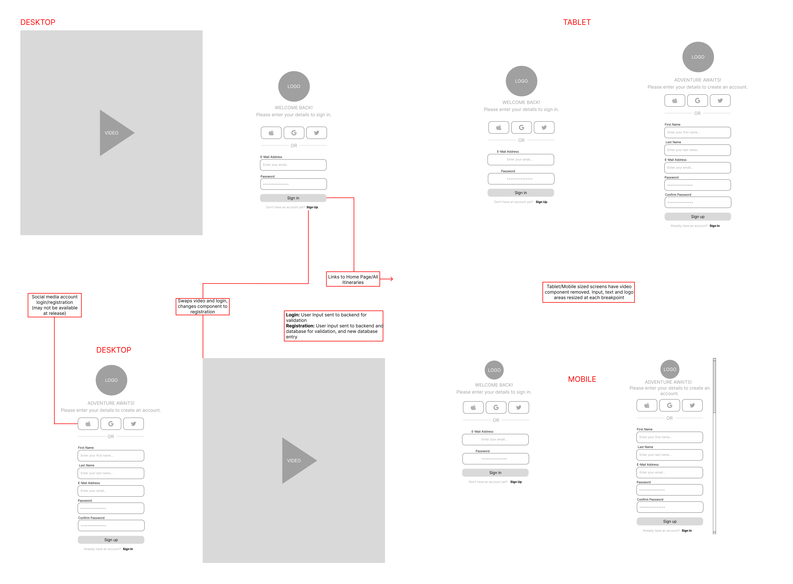

##### ${\textsf{\color{pink}ALL ITINERARIES}}$

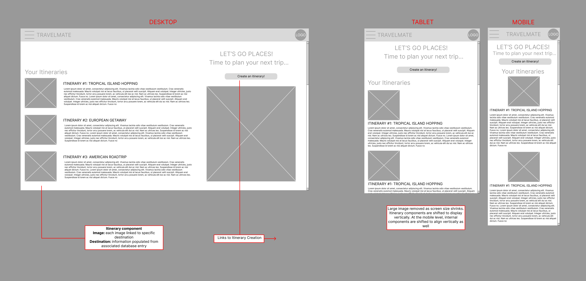

##### ${\textsf{\color{pink}CREATE ITINERARY}}$

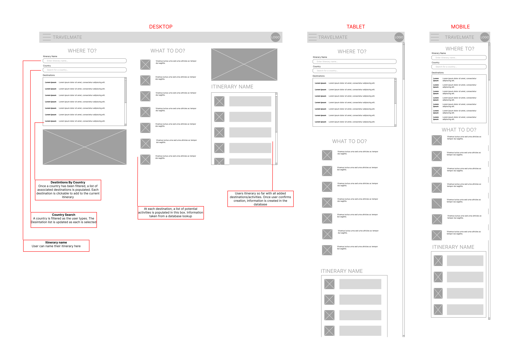

##### ${\textsf{\color{pink}VIEW ITINERARY (SINGLE)}}$

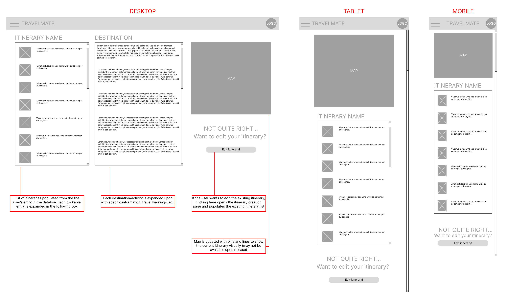

## ${\textsf{\color{lightgreen}WIREFRAMES (INDIVIDUAL)}}$

### ${\textsf{\color{lightblue}DESKTOP (FROM 1024PX)}}$

##### ${\textsf{\color{pink}LOGIN}}$

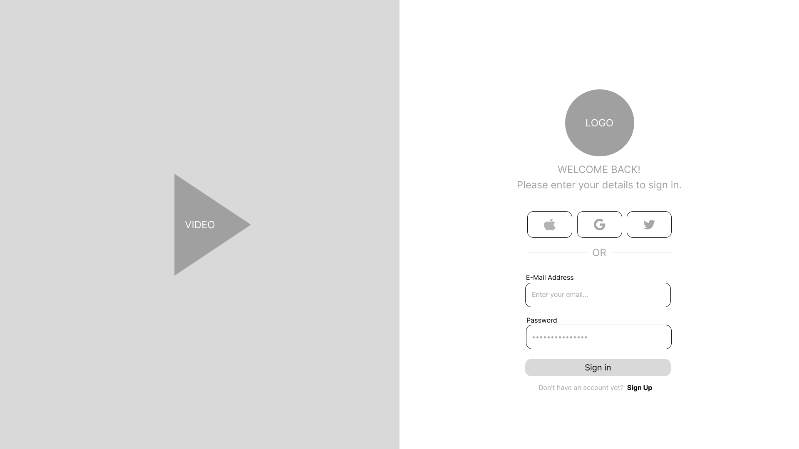

##### ${\textsf{\color{pink}REGISTER ACCOUNT}}$

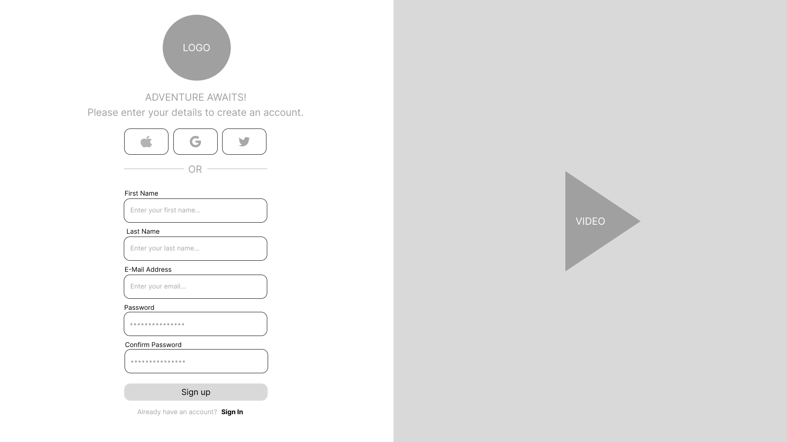

##### ${\textsf{\color{pink}ALL ITINERARIES}}$


##### ${\textsf{\color{pink}CREATE ITINERARY}}$


##### ${\textsf{\color{pink}VIEW ITINERARY (SINGLE)}}$

.png)

### ${\textsf{\color{lightblue}TABLET (FROM 769PX)}}$

##### ${\textsf{\color{pink}LOGIN}}$

.png)

##### ${\textsf{\color{pink}REGISTER ACCOUNT}}$

.png)

##### ${\textsf{\color{pink}ALL ITINERARIES}}$

.png)

##### ${\textsf{\color{pink}CREATE ITINERARY}}$

.png)

##### ${\textsf{\color{pink}VIEW ITINERARY (SINGLE)}}$

%20(Tablet).png)

### ${\textsf{\color{lightblue}MOBILE (UPTO 768PX)}}$

##### ${\textsf{\color{pink}LOGIN}}$

.png)

##### ${\textsf{\color{pink}REGISTER ACCOUNT}}$

.png)

##### ${\textsf{\color{pink}ALL ITINERARIES}}$

.png)

##### ${\textsf{\color{pink}CREATE ITINERARY}}$

.png)

##### ${\textsf{\color{pink}VIEW ITINERARY (SINGLE)}}$

%20(Mobile).png)

## ${\textsf{\color{lightgreen}PROJECT MANAGEMENT}}$

## ${\textsf{\color{lightblue}Project Management Process Overview}}$

### ${\textsf{\color{pink}Methodology: Agile (Scrum)}}$

Our team is using the Agile (Scrum) methodology to manage the TravelMate Itinerary Builder project. This approach allows us to be flexible and adaptive to changes while ensuring that we deliver value incrementally throughout the project lifecycle (Atlassian, 2024). Key aspects of our project management process include:

1. **Sprint Planning:**
   - At the beginning of each sprint, we hold a planning session where we review the project backlog and prioritise tasks for the upcoming sprint.
   - Tasks are assigned to team members based on their strengths and expertise, ensuring that each person is working on tasks that align with their skill set.

2. **Daily Standups:**
   - We conduct daily standup meetings where each team member provides updates on what they have accomplished, what they plan to work on, and any blockers they are facing.
   - This helps us stay aligned as a team and address any issues promptly.

3. **Sprint Reviews and Retrospectives:**
   - At the end of each sprint, we hold a review session to demonstrate the completed work and gather feedback.
   - We also conduct a retrospective to discuss what went well, what could be improved, and how we can enhance our processes in future sprints.

4. **Task Assignments:**
   - Tasks are assigned to team members based on their strengths and expertise. For example:
     - **Mina** is focusing on backend development and project documentation.
     - **James** and **William** are responsible for frontend development and user interface design. They will be working on testing and quality assurance also.
   - This approach ensures that each team member is contributing in areas where they are most effective.

### ${\textsf{\color{pink}Project Initialization}}$

As part of our project management process, we have documented the initial setup and planning stages. Below are screenshots that capture the key moments during the project initialization phase.

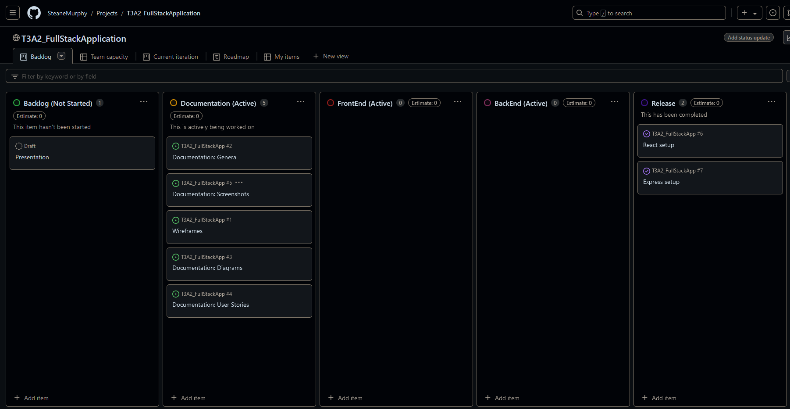

### ${\textsf{\color{pink}Sprint Meetings}}$

To demonstrate our commitment to Agile (Scrum) practices, we have also documented our sprint meetings. These photos show the team collaborating during our sprint planning, daily standups, and sprint review sessions.

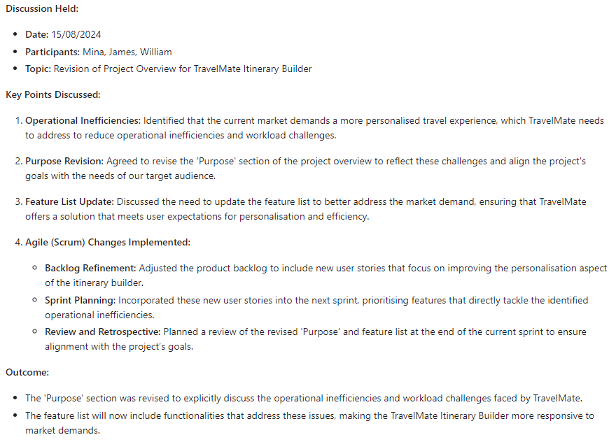

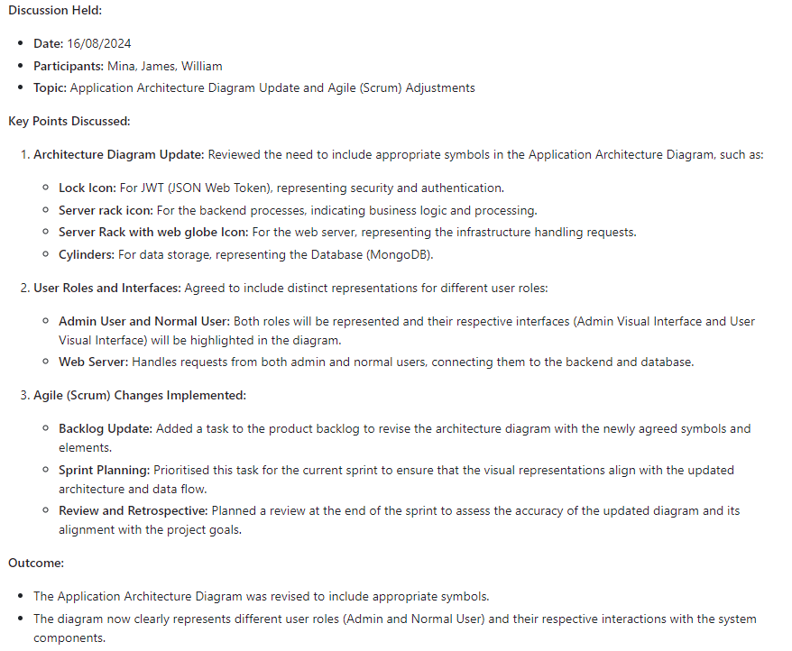

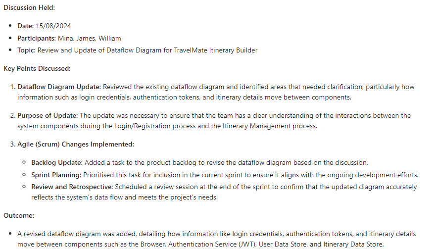

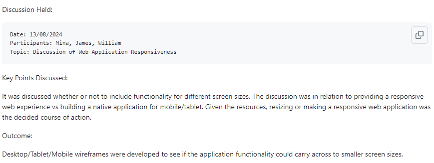

### ${\textsf{\color{pink}PartA Project End Progression}}$

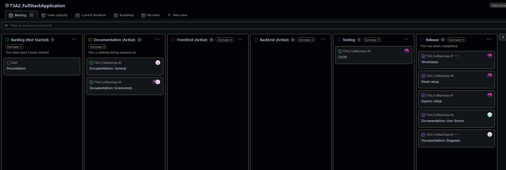

### ${\textsf{\color{pink}Conclusion}}$

Our project management process is designed to ensure that we deliver high-quality work in a structured and efficient manner. By utilizing Agile (Scrum) practices and assigning tasks based on team members' strengths, we are confident in our ability to meet the project's goals and deliver a successful TravelMate Itinerary Builder application.

### ${\textsf{\color{pink}Client Testing Evidence}}$

## Overview

Throughout the development process, we adhered to a Continuous Integration/Continuous Deployment (CI/CD) policy, ensuring that each feature was thoroughly tested before deployment. Below is the evidence of client testing, including screenshots and explanations of how features were tested on the deployed site.

## User Authentication Testing

**Feature:** User Registration and Login  
**Test Objective:** Ensure that users can register and log in successfully.

**Testing Steps:**

1. Navigated to the registration page.
2. Filled in the registration form with test data.
3. Submitted the form and verified that the user was redirected to the home page.

**Screenshots:**

- Screenshot 1: Completed registration form

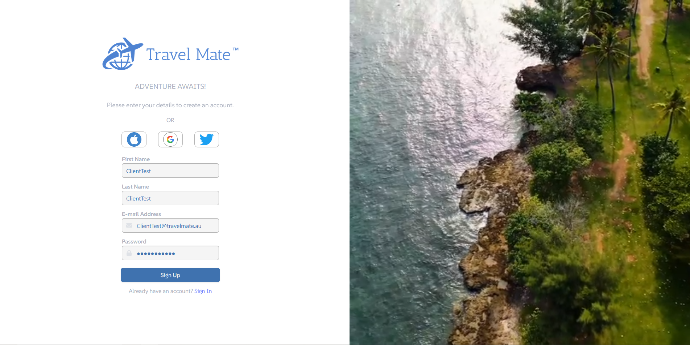

- Screenshot 2: User redirected to the home page

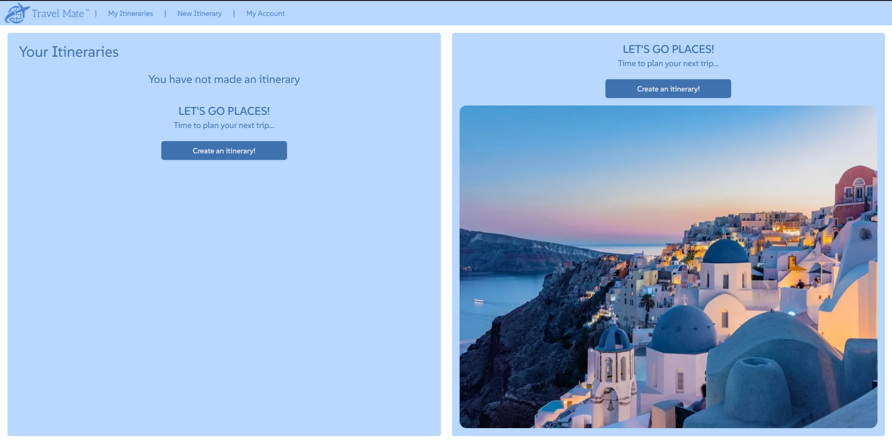

**Results:** Successful registration and login. No issues encountered.

## Itinerary Creation Testing

**Feature:** Creating a New Itinerary  
**Test Objective:** Ensure that users can create and save a new itinerary.

**Testing Steps:**

1. Logged in as a test user.
2. Navigated to the "Create New Itinerary" page.
3. Entered itinerary details, including destinations and activities.
4. Saved the itinerary and verified that it appeared in the user's dashboard.

**Screenshots:**

- Screenshot 1: Filled-out itinerary creation form

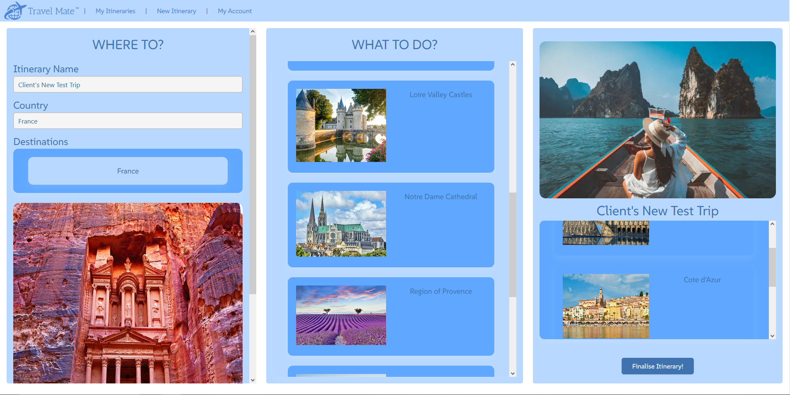

- Screenshot 2: Itinerary listed in the user's dashboard

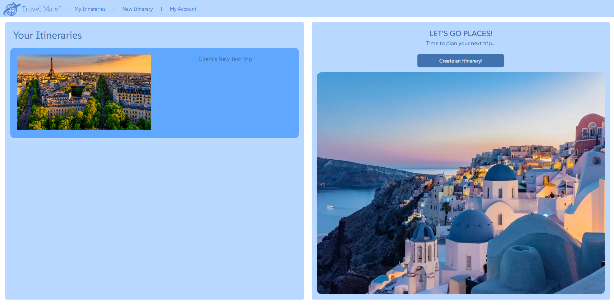

**Results:** The itinerary was successfully created and displayed on the dashboard.

## Destination Management Testing

**Feature:** Management of Destinations  
**Test Objective:** Ensure that users can effectively create, update, and delete destinations.

**Testing Steps:**

1. Logged in as a test user.
2. Created a new destination and verified that it appeared in the list of destinations.
3. Updated the newly created destination and checked that the changes were saved.
4. Deleted the destination and confirmed that it was removed from the list.

**Screenshots:**

- Screenshot 1: Logged in as test user

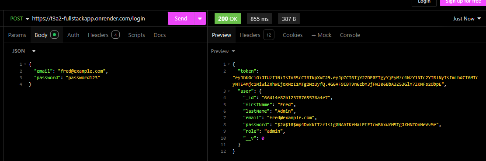

- Screenshot 2: Interface showing destination creation

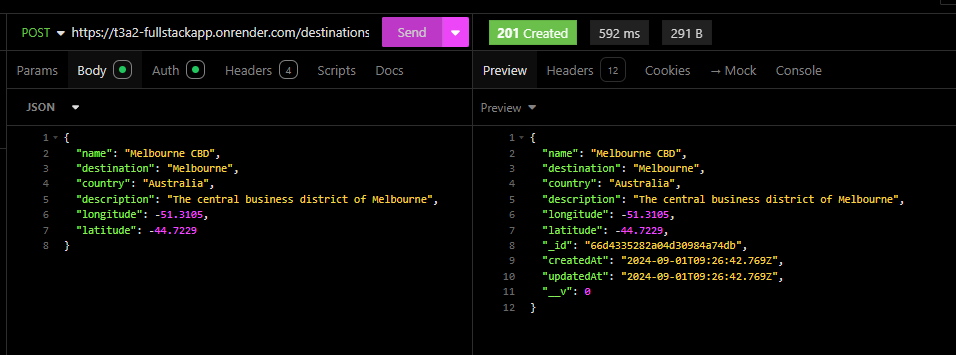

- Screenshot 3: Updated destination details

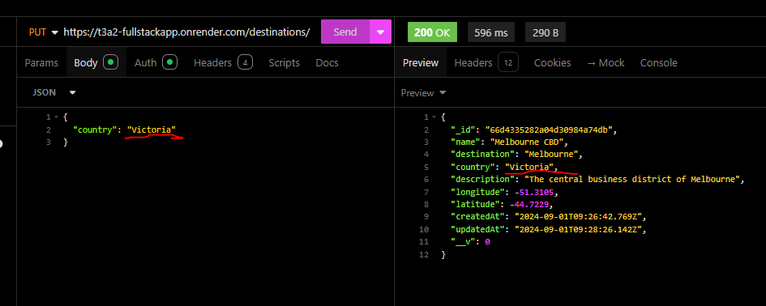

- Screenshot 4: Confirmation of destination deletion

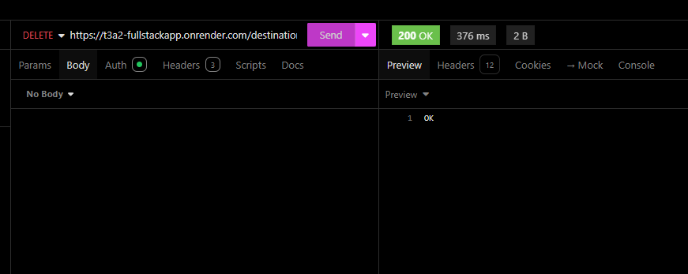

**Results:** All destination management functions worked as expected.

## Responsive Design Testing

**Feature:** Mobile and Tablet Responsiveness  
**Test Objective:** Ensure that the site is fully responsive on various devices.

**Testing Steps:**

1. Accessed the deployed site on different devices (e.g., mobile, tablet, desktop).
2. Verified that the layout adjusted correctly for each device.
3. Ensured that all features remained functional on smaller screens.

**Screenshots:**

- Screenshot 1: Mobile view of the dashboard

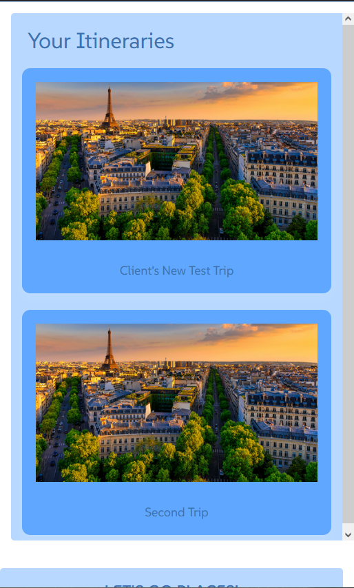

- Screenshot 2: Tablet view of the itinerary creation page

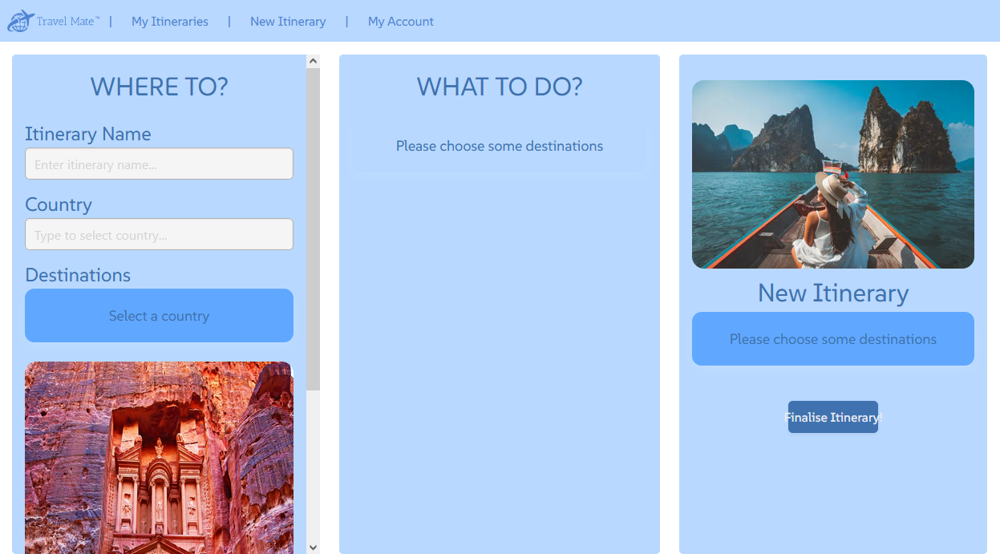

**Results:** The site is fully responsive, with no layout issues on different devices.

## Conclusion

By following CI/CD practices and implementing automated testing (using Jest and Supertest for both frontend and backend), we ensured that the key features of the application were rigorously tested before release. This process allowed us to deliver a reliable and functional product, providing a seamless user experience across all platforms.

# INSTALLATION

This project has a combined frontend and backend. Once the repository has been cloned into a new directory, installation steps must be undertaken in two different sub-directories.

Install NVM package manager if you do not already have it installed:

```bash
curl -o- https://raw.githubusercontent.com/nvm-sh/nvm/v0.39.4/install.sh | bash
```

Please ensure you have installed Node.js in your environment:

```bash
nvm install node
```

## FRONTEND

Navigate to:

```bash
cd src/client/travelApp
```

Once in the main directory for the Vite/React application, dependencies must be installed using:

```bash
npm install
```

Inside this sub-directory is a '.env.development.sample' file and a '.env.production.sample' file. To run a local version of this application, make a copy of the '.env.development.sample' file and name it '.env.development'. In this file is a string called VITE_API_URL. Set this string to the local URL: 'http://localhost:4000' as this is the port that express will use.

## BACKEND

Navigate to:

```bash
cd src/server
```

Once in the main directory for the Express.js application, dependencies must be installed using:

```bash
npm install
```

Inside this sub-directory is a '.env.sample' file. Please make a new file named '.env' and copy the contents of '.env.sample' to the new '.env' file. This file will have two variables "DB_URI" and "JWT_SECRET" that need to be manually set. As this is a public repo, the strings for these two variables have been provided to you (lecturer) in the assessment notes.

## RUNNING THE APPLICATION

Both the local express server and the local react server need to run simultaneously. To run the server, first navigate to the correct directory:

```bash
cd src/server
```

Then initialise the seed file:

```bash
node seed.js
```

Then run the server:

```bash
node index.js
```

Whilst the server is running, navigate to the frontend directory:

```bash
cd src/client/travelApp
```

And run the server:

```bash
npm run dev
```

## ${\textsf{\color{lightgreen}REFERENCES}}$

Atlassian 2024, *What is the Agile methodology*, viewed 13 August 2024, <https://www.atlassian.com/agile>

American Express 2024, *2024 Global Travel Trends Report*, viewed 12 August 2024, <https://www.americanexpress.com/en-us/travel/discover/get-inspired/global-travel-trends>

Geertsm, W, Borko, S, Arora, V, Agarwal, P & Zanpure, S, *The State of the Travel Agency Sector 2023*, Skift, viewed 12 August 2024, <https://research.skift.com/report/state-of-travel-2023/>

Global Business Travel Association (GBTA), 2023, *2023 Business Travel Outlook*, GBTA, viewed 12 August 2024, <https://www.gbta.org/wp-content/uploads/GBTA-2023-BTI-Full-Report_FINAL>.

LucidChart 2024, *What is a Data Flow Diagram*, viewed 11 August 2024, <https://www.lucidchart.com/pages/data-flow-diagram>

LucidChart 2024. *How to draw 5 types of architectural diagrams*, viewed 11 August, <https://www.lucidchart.com/blog/how-to-draw-architectural-diagrams>

Yee, L, Chui, M & Roberts, R, 2024, *McKinsey Technology Trends Outlook 2024*, McKinsey Digital, 16 July, viewed 12 August 2024, <https://www.mckinsey.com/capabilities/mckinsey-digital/our-insights/the-top-trends-in-tech>